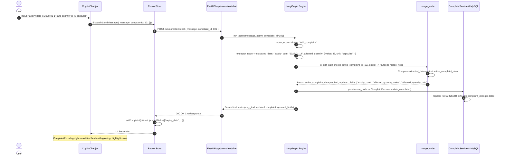

# 04 - End-to-End Request Flow Trace

## Overview
This document presents step-by-step technical traces for the three primary interactions supported by the **AIVOA Copilot** system:
1. **New Complaint Logging Flow**
2. **Follow-Up Complaint Edit Flow**
3. **Document Upload & Extraction Flow**

Every phase includes file names, function signatures, state mutations, and data representations.

---

## 1. Flow 1: Brand-New "Log Complaint" Request

### Step-by-Step Execution Trace

#### 1. Frontend Trigger & Redux Dispatch
- **Component**: [`frontend/src/components/CopilotChat.jsx`](file:///home/saistack/Complaint%20Management%20System/frontend/src/components/CopilotChat.jsx#L22-L40)
- **User Action**: User types: *"Apollo Pharmacy reported discolored capsules in Amoxicillin 500mg, batch BMX240601."* and clicks **Send**.
- **Function**: `handleSend()` checks `input.trim()`, resets input state, and dispatches Redux async thunk:
  ```javascript
  dispatch(sendMessage({ message: msg, complaintId: null }));
  ```
- **Redux Thunk**: [`frontend/src/store/chatSlice.js`](file:///home/saistack/Complaint%20Management%20System/frontend/src/store/chatSlice.js#L5-L23) fires `sendMessage.pending`, setting `isProcessing = true`. HTTP POST request sent to `/api/complaint/chat`.

#### 2. FastAPI Endpoint Entry
- **File**: [`backend/app/routes/chat.py`](file:///home/saistack/Complaint%20Management%20System/backend/app/routes/chat.py#L15-L28)
- **Function**: `chat_endpoint(request: ChatRequest, db: Session = Depends(get_db))`
- **Payload Validation**: Pydantic validates `ChatRequest(message="...", complaint_id=None)`.
- **Execution Call**: Passes execution to `run_agent()` in `app/agent/graph.py`.

#### 3. LangGraph Agent Execution
- **File**: [`backend/app/agent/graph.py`](file:///home/saistack/Complaint%20Management%20System/backend/app/agent/graph.py#L47-L135)
- **Function**: `run_agent()` initializes state via `initial_state(user_message)`:
  - `active_complaint_id = None`
  - `validation_retries = 0`
- **Node Traversals**:
  1. **`router_node`** ([`nodes.py:27`](file:///home/saistack/Complaint%20Management%20System/backend/app/agent/nodes.py#L27)): Invokes Groq LLM with `SYSTEM_PROMPT_ROUTER`. Returns `{"intent": "new_complaint"}`.
  2. **`extractor_node`** ([`nodes.py:54`](file:///home/saistack/Complaint%20Management%20System/backend/app/agent/nodes.py#L54)): Calls Groq LLM with `SYSTEM_PROMPT_EXTRACTOR`. Parses JSON:
     - `complainant`: `"Apollo Pharmacy"`
     - `product_name`: `"Amoxicillin"`
     - `product_strength`: `"500mg"`
     - `batch_number`: `"BMX240601"`
     - `complaint_category`: `"Discoloration"` (auto-mapped via `map_category()`)
  3. **`is_edit_path`** ([`graph.py:23`](file:///home/saistack/Complaint%20Management%20System/backend/app/agent/graph.py#L23)): Evaluates `state["active_complaint_id"]`. Since `None`, routes to `validator`.
  4. **`validator_node`** ([`nodes.py:120`](file:///home/saistack/Complaint%20Management%20System/backend/app/agent/nodes.py#L120)): Confirms meaningful data exists (`len(useful_fields) > 1`). Returns `validation_errors: []`.
  5. **`should_retry_validation`** ([`graph.py:30`](file:///home/saistack/Complaint%20Management%20System/backend/app/agent/graph.py#L30)): Routes to `duplicate_check`.
  6. **`duplicate_detection_node`** ([`nodes.py:146`](file:///home/saistack/Complaint%20Management%20System/backend/app/agent/nodes.py#L146)): Calls `DuplicateDetectionService(db).find_duplicate()`. Checks exact match on `(Amoxicillin, BMX240601)`. Returns `duplicate_info: None`.
  7. **`risk_assessment_node`** ([`nodes.py:212`](file:///home/saistack/Complaint%20Management%20System/backend/app/agent/nodes.py#L212)): Invokes Groq LLM with `SYSTEM_PROMPT_RISK`. Output:
     ```json
     {
       "severity": "Major",
       "next_action": "Route to QA investigation and initiate batch retention sampling.",
       "rationale": "Product quality deviation (discoloration) in oral solid dosage form.",
       "confidence": 0.85
     }
     ```
  8. **`persistence_node`** ([`nodes.py:246`](file:///home/saistack/Complaint%20Management%20System/backend/app/agent/nodes.py#L246)):
     - Calls `ComplaintService(db).create_complaint(data)` -> Generates `display_id="CMP-2026-0001"`, commits `Complaint` record to MySQL.
     - Logs initial field entries in `complaint_changes` table.
     - Calls `save_risk_assessment()` -> Inserts record into `risk_assessments` table.
  9. **`responder_node`** ([`nodes.py:286`](file:///home/saistack/Complaint%20Management%20System/backend/app/agent/nodes.py#L286)): Constructs plain-text string: `"Logged complaint for Amoxicillin from Apollo Pharmacy (Batch: BMX240601).\n\nClassification: Major severity. Route to QA investigation."`

#### 4. Response & Redux State Synchronization
- **API Response**: Returns `ChatResponse` JSON.
- **Redux Fulfillment**: `chatSlice` receives payload. Appends user message and assistant reply to `state.messages`.
- **Form State Dispatch**: `CopilotChat.jsx` dispatches:
  - `setComplaint(payload.complaint)` -> Populates `complaintSlice` state.
  - `setRiskAssessment(payload.risk_assessment)` -> Sets risk state.
- **UI Update**: `ComplaintForm.jsx` re-renders displaying `CMP-2026-0001`, product details, and the `Major` severity badge in `RiskAssessment.jsx`.

---

## 2. Flow 2: Follow-Up "Edit Complaint" Request



### How the Edit Node Avoids Overwriting Untouched Fields
In [`backend/app/agent/nodes.py:merge_node()`](file:///home/saistack/Complaint%20Management%20System/backend/app/agent/nodes.py#L176-L209):
1. The extractor extracts *only* explicit fields mentioned in the follow-up message (`expiry_date` and `affected_quantity`). Unmentioned fields (`product_name`, `batch_number`, `complainant`) are assigned `None` by LLM prompt rules.
2. `merge_node` iterates over `new_data.items()`:
   ```python
   for field, value in new_data.items():
       if value is not None and value != "":
           if existing.get(field) != value:
               existing[field] = value
               updated_fields.append(field)
   ```
3. Fields with `None` or empty values are explicitly ignored, preserving the original complaint data intact.

---

## 3. Flow 3: Document Upload Flow (PDF / DOCX / TXT / EML)

### Execution Trace
1. **File Selection**: User selects `complaint_report.pdf` via file input button in `CopilotChat.jsx`.
2. **Redux Upload Dispatch**: Dispatches `uploadDocument(file)` in `chatSlice.js`.
3. **Endpoint Handling**: Calls [`/api/complaint/upload`](file:///home/saistack/Complaint%20Management%20System/backend/app/routes/upload.py#L20-L66) in `upload.py`:
   - Checks size (`len(contents) <= 10MB`).
   - Validates MIME type via `validate_mime_type()`.
   - Saves file to `backend/uploads/` via `save_upload()`.
   - Extracts raw text via [`extract_text()`](file:///home/saistack/Complaint%20Management%20System/backend/app/utils/file_handler.py#L67-L99) using PyMuPDF (`fitz`).
4. **Agent Execution**: Calls `run_agent()` with `uploaded_text=extracted_text`.
5. **Router Override**: In `router_node()`, presence of `uploaded_text` automatically forces `intent = "document_extraction"`.
6. **Extraction & Persistence**: Pipeline extracts fields from text, performs duplicate detection, scores risk, creates DB record, and returns populated complaint object to UI.
7. **Post-Extraction Edits**: The newly created `complaint_id` is set active in Redux. Any subsequent chat message from the user immediately acts as an **Edit Flow** (Flow 2) against this document-generated complaint!

---

## 4. Things I Should Double-Check & Defend in the Interview

> [!WARNING]
> **Weak Points & Defensibility**

1. **PDF OCR Limitations**:
   - *Current Implementation*: If PyMuPDF extracts empty string (scanned image PDF), `extract_text_from_pdf()` returns `"[Image-only PDF — no extractable text. OCR not available.]"`.
   - *Interview Defense*: Highlight that integrating Tesseract OCR or AWS Textract would solve scanned image extraction in V2.
2. **Active Complaint ID Context Loss**:
   - *Current Implementation*: Active complaint ID is maintained in client Redux state and passed per request (`complaintId`).
   - *Interview Defense*: If the user refreshes the browser, active chat context defaults to `null`. Mention that adding URL query parameters (e.g. `?complaintId=101`) or storing active ID in `localStorage` would persist state across page reloads.
